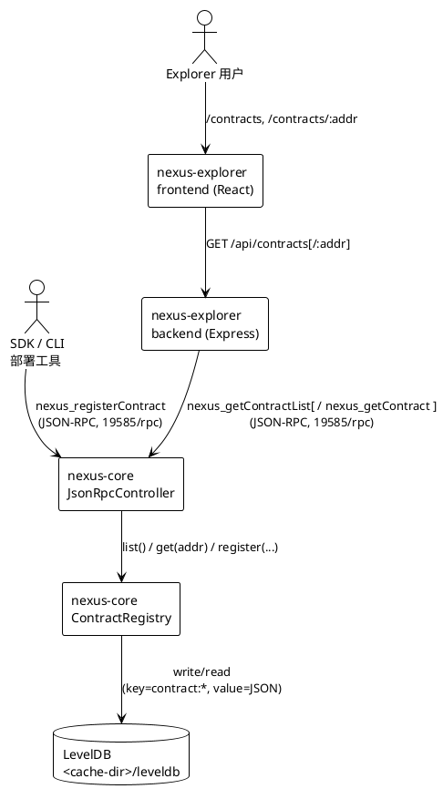
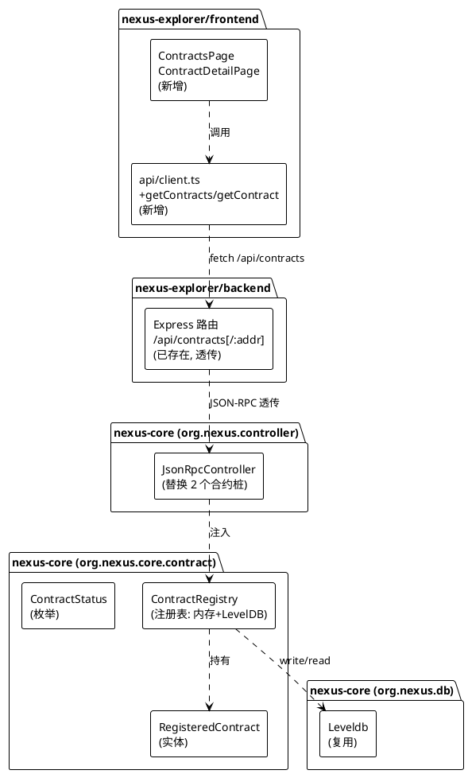
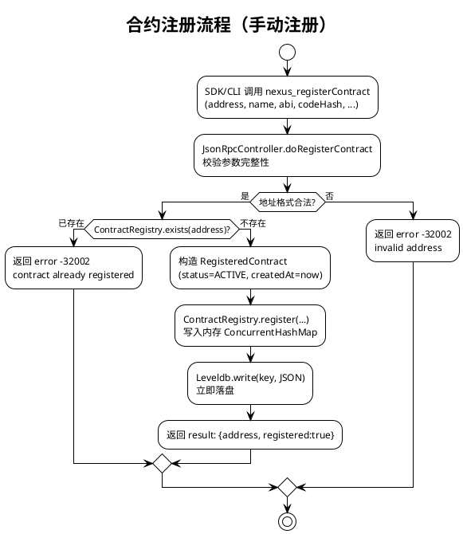
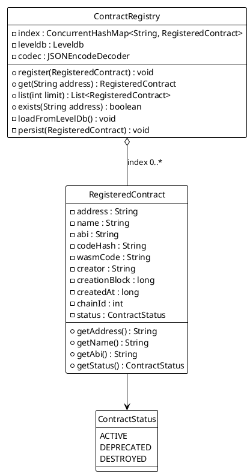

# 合约注册/查询子系统设计文档

> 目标：在 `nexus-core` 内构建一套**自包含的合约注册/查询子系统**（不依赖外部合约清单 JSON/DB），替换 `JsonRpcController` 中 `nexus_getContractList` / `nexus_getContract` 当前的"诚实空"桩实现，使 nexus-explorer 合约页能展示真实合约元数据。
>
> 本文档只产出架构与接口设计，不含实现代码。

## 一、需求与存量功能关系分析

### 1.1 需求功能与存量功能对比

#### 1.1.1 已实现功能

| 需求功能 | 存量功能 | 代码位置 | 匹配度 |
|---------|---------|---------|--------|
| Explorer 后端合约列表路由 | `/api/contracts` 路由已存在，调用 `rpcClient.getContractList()` | `nexus-explorer/backend/src/index.ts:147-155` | 100% |
| Explorer 后端合约详情路由 | `/api/contracts/:addr` 路由已存在，调用 `rpcClient.getContract(addr)` | `nexus-explorer/backend/src/index.ts:161-172` | 100% |
| Explorer 后端 RPC 客户端合约方法 | `getContractList()`→`nexus_getContractList`、`getContract(addr)`→`nexus_getContract` 已封装 | `nexus-explorer/backend/src/rpc.ts:202-211` | 100% |
| Explorer 后端合约 RPC 响应类型 | `RpcContract` 接口已定义 `{address, creator, codeHash, wasmCode, createdAt, abi?}` | `nexus-explorer/backend/src/rpc.ts:39-46` | 75% |
| core JSON-RPC 桥接分发骨架 | `JsonRpcController.dispatch` 已含 `nexus_getContractList` / `nexus_getContract` 分支 | `nexus-core/.../controller/JsonRpcController.java:136-139` | 50% |
| core 轻量 KV 持久化组件 | `Leveldb`（`write(byte[],byte[])` / `read(byte[])`）已可用 | `nexus-core/.../db/Leveldb.java:51-89` | 100% |
| core 内存+LevelDB 双层范例 | `PeersStorage`：`@PostConstruct` 加载、`@Scheduled` 落盘 | `nexus-core/.../p2p/PeersStorage.java:33-52` | 100% |

#### 1.1.2 需要扩展的功能

| 需求功能 | 存量功能 | 差异说明 | 扩展方向 |
|---------|---------|---------|---------|
| core 合约列表真实数据 | `doGetContractList` 返回空 `ArrayList`（诚实空桩） | `JsonRpcController.java:396-398` 无合约存储，硬编码返回空 | 注入 `ContractRegistry`，返回注册表内存视图 |
| core 合约详情真实数据 | `doGetContract` 返回 `-32001 not found`（诚实空桩） | `JsonRpcController.java:401-405` 无合约存储，恒返回未找到 | 注入 `ContractRegistry`，按地址查注册表，命中则翻译为 `RpcContract` 形状 |
| Explorer 合约 RPC 响应字段 | `RpcContract` 含 `wasmCode`（合约字节码） | 列表页无需返回完整 wasmCode（体积大），详情页才需要 | 列表响应用精简形状（无 wasmCode），详情响应含全字段；后端 `RpcContract` 拆为列表/详情两形状 |
| core 合约注册入口 | 无任何合约注册 API | 链上无 WASM 合约执行/事件子系统，无法从链上推导合约元数据 | 新增 `nexus_registerContract` JSON-RPC 方法（手动注册） |

#### 1.1.3 需要新增的功能或接口

**core 侧（`org.nexus.core.contract` 新包）**

- 合约注册实体 `RegisteredContract`：合约地址、ABI、名称、创建块高、所属链标识、创建时间、状态、创建者、codeHash 等字段。
- 合约注册表 `ContractRegistry`：内存索引（`ConcurrentHashMap`）+ LevelDB 持久化双层；启动加载、写入落盘、按地址查询、列表分页。
- 合约注册 RPC 方法 `nexus_registerContract`：供 SDK/CLI/部署工具在合约部署后写入注册表。

**Explorer 前端侧（`nexus-explorer/frontend`）**

- 合约列表页 `ContractsPage`：路由 `/contracts`，展示已注册合约列表。
- 合约详情页 `ContractDetailPage`：路由 `/contracts/:addr`，展示单合约元数据 + ABI。
- 前端 API 客户端方法 `getContracts` / `getContract`。
- 前端类型 `ContractInfo` / `ContractDetail`。

### 1.2 存量功能详细分析

#### 1.2.1 JsonRpcController 合约桩（待替换点）

- **接口契约**：`POST /rpc`，JSON-RPC 2.0 信封 `{jsonrpc:"2.0", id, method, params}`。`nexus_getContractList(params=[])` 当前返回 `result: []`；`nexus_getContract(params=[address])` 当前返回 `error: {code:-32001, message:"contract not found ..."}`。
- **业务规则**：`doGetContractList` 无参，恒返回空数组；`doGetContract` 取 `params[0]` 为地址，恒返回 not found。
- **扩展点**：`dispatch` 的 switch 分支已就位，只需把 `doGetContractList` / `doGetContract` 的方法体从桩替换为委托 `ContractRegistry`。**不改动其余 9 个已桥接方法**（v2 RPC 桥接 11/11 中的 9 个真实方法 + 2 个合约桩）。
- **约束**：core 为 Spring Boot 2.7.18 + `javax.servlet`；`ObjectMapper` 为类静态字段；返回值经 `MAPPER.valueToTree(result)` 序列化，故注册表返回的 POJO 需为 Jackson 友好结构。

#### 1.2.2 Leveldb 组件（复用点）

- **接口契约**：`write(byte[] key, byte[] value)` 写入后立即 close DB（每次开闭，非批量）；`read(byte[] key)` 同理；`addPoolDb(String,String)` / `readPoolDb(String)` 是 UTF-8 字符串便捷封装。存储目录由 `nexus.cache-dir` 配置（默认 `<user.dir>/leveldb`）。
- **业务规则**：单 LevelDB 实例共享同一目录，多 key 共存；`clear-cache=true` 启动时清空目录。
- **约束**：非线程安全的开闭模式（每次操作 open/put/close），并发写入需调用方加锁或用单线程；不适合高频写，适合低频写+启动批量加载。合约注册表写入频率低（仅部署时注册），契合此模式。

#### 1.2.3 PeersStorage 双层范例（参考模式）

- **模式**：`@PostConstruct init()` 启动时 `leveldb.read(KEY)` 加载到内存；`@Scheduled(fixedDelay)` 定时把内存快照 `leveldb.write(KEY, json)` 落盘。
- **约束**：内存为权威源，落盘为崩溃恢复兜底；编解码用 `JSONEncodeDecoder`。合约注册表将复用此模式，但落盘改为**写入即落盘**（注册是低频关键操作，无需定时批量）。

#### 1.2.4 Explorer 三层调用链（接线约束）

- **链路**：frontend(5173) → vite proxy `/api` → backend(3000) → JSON-RPC `POST /rpc` → core(19585)。
- **约束**：backend `rpc.ts` 的 `RpcContract` 形状是 core 与 frontend 的契约中间层；core 返回的 JSON 字段名必须与 `RpcContract` 对齐（`address/creator/codeHash/wasmCode/createdAt/abi`），否则 backend 透传后前端字段错位。
- **约束**：frontend `api/client.ts` 的 `API_BASE` 默认 `http://localhost:3000`，但 vite proxy 已把 `/api` 代理到 3000，故前端实际用相对路径 `/api/...` 即可（当前 `client.ts` 用 `${API_BASE}${path}`，生产需配 `VITE_API_BASE` 为空串或同源）。

## 二、增量设计方案

### 2.1 实现模型

#### 2.1.1 上下文视图

图：合约子系统上下文图



- 上游调用方：SDK/CLI 部署工具（注册）、Explorer 用户（查询）。
- 下游依赖：core 内 `Leveldb` 组件（已存在），无新增外部依赖。
- 通信协议：JSON-RPC 2.0 over HTTP（core 19585）；REST over HTTP（explorer backend 3000）。
- 调用频率：注册低频（仅部署时）；查询中频（Explorer 页面加载，可缓存）。

#### 2.1.2 服务/组件总体架构

图：合约子系统组件架构图



- 模块划分：新增 `org.nexus.core.contract` 包，含实体、注册表、状态枚举；`JsonRpcController` 仅替换桩方法体，不新增控制器类。
- 核心类职责：
  - `RegisteredContract`：不可变值对象，承载合约元数据。
  - `ContractRegistry`：`@Component`，内存 `ConcurrentHashMap<String, RegisteredContract>` 为权威源，LevelDB 为持久层；提供 `register / get / list / exists` 方法。
  - `ContractStatus`：枚举（`ACTIVE` / `DEPRECATED` / `DESTROYED`）。
- 配置项：`nexus.contract.registry-enabled`（默认 true，关闭则回退空桩行为）、`nexus.contract.max-list-size`（默认 100）。

#### 2.1.3 实现设计文档

图：合约注册流程活动图



- **状态机设计**：合约状态 `ACTIVE → DEPRECATED → DESTROYED`，单向流转；`register` 只能创建 `ACTIVE`，状态变更通过独立 RPC 方法（后续增强，本期仅 `ACTIVE`）。
- **事务设计**：内存写 + LevelDB 写非原子。策略：**先内存后落盘**——内存写成功即对查询可见（最终一致），落盘失败仅记 WARN 日志（不回滚内存，因注册是幂等关键操作，重启时从 LevelDB 加载，若落盘失败则重启后丢失该条，需重新注册；可接受，因注册低频且可重试）。不引入分布式事务。
- **扩展点**：`ContractRegistry` 抽象为接口 `IContractRegistry`，默认 LevelDB 实现；后续可替换为 PostgreSQL 实现（实现同一接口）。

### 2.2 接口设计

#### 2.2.1 总体设计

| 接口 | 协议 | 端点 | 稳定性 | 说明 |
|------|------|------|--------|------|
| 合约列表查询 | JSON-RPC | `nexus_getContractList` | 稳定 | 替换空桩，Explorer 列表页用 |
| 合约详情查询 | JSON-RPC | `nexus_getContract` | 稳定 | 替换 not-found 桩，Explorer 详情页用 |
| 合约手动注册 | JSON-RPC | `nexus_registerContract` | 实验 | 新增，SDK/CLI 部署后调用 |
| 合约列表 REST | HTTP | `GET /api/contracts` | 稳定 | backend 已存在，透传 |
| 合约详情 REST | HTTP | `GET /api/contracts/:addr` | 稳定 | backend 已存在，透传 |

- 接口分类：查询接口（稳定，Explorer 用）、注册接口（实验，部署工具用）。
- 接口变更策略：`nexus_getContractList` / `nexus_getContract` 方法名与参数不变（向后兼容桩），仅 result 内容从空变为真实数据。
- 版本管理：JSON-RPC 方法名前缀 `nexus_` 不变；注册方法标注 `@since` 注释。

#### 2.2.2 接口清单

##### nexus_getContractList（合约列表查询）

- **接口签名**：`nexus_getContractList(params: [limit?]) → RpcContractListItem[]`
- **业务说明**：返回已注册合约列表，按 `createdAt` 倒序。列表项**不含** `wasmCode`（体积大）。
- **前置条件**：core 已启动，`ContractRegistry` 已加载。
- **后置条件**：无副作用（纯查询）。
- **异常映射**：无参异常；`limit` 越界自动夹逼到 `[1, max-list-size]`。

代码示例：合约列表 JSON-RPC 响应

```json
{
  "jsonrpc": "2.0",
  "id": 1,
  "result": [
    {
      "address": "0x1a2b...cdef",
      "name": "PaymentChannel",
      "creator": "0x9f8e...aa01",
      "codeHash": "0xabcd...1234",
      "createdAt": 1720000000,
      "creationBlock": 12345,
      "chainId": 1,
      "status": "ACTIVE"
    }
  ]
}
```

##### nexus_getContract（合约详情查询）

- **接口签名**：`nexus_getContract(params: [address]) → RpcContractDetail | null`
- **业务说明**：按合约地址返回完整元数据，**含** `abi`（详情页展示方法签名用）。
- **前置条件**：`address` 为合法 hex 地址。
- **后置条件**：无副作用。
- **异常映射**：地址不存在返回 `error {-32001, "contract not found"}`（与原桩错误码一致，向后兼容）；地址格式非法返回 `error {-32002, "invalid address"}`。

代码示例：合约详情 JSON-RPC 响应

```json
{
  "jsonrpc": "2.0",
  "id": 2,
  "result": {
    "address": "0x1a2b...cdef",
    "name": "PaymentChannel",
    "creator": "0x9f8e...aa01",
    "codeHash": "0xabcd...1234",
    "wasmCode": "0x0061736d...",
    "abi": [
      { "type": "function", "name": "open", "inputs": [], "outputs": [] }
    ],
    "createdAt": 1720000000,
    "creationBlock": 12345,
    "chainId": 1,
    "status": "ACTIVE"
  }
}
```

##### nexus_registerContract（合约手动注册）

- **接口签名**：`nexus_registerContract(params: [address, name, abi, codeHash, wasmCode, creationBlock, creator]) → {address, registered}`
- **业务说明**：部署工具在合约上链后调用，写入注册表。幂等：重复注册同地址返回 `error {-32003, "already registered"}`。
- **前置条件**：`address` 格式合法且注册表中不存在；`name` 非空；`codeHash` 非空。
- **后置条件**：内存注册表新增条目；LevelDB 落盘一条 `contract:<address>` 键值。
- **异常映射**：已存在 `-32003`；参数缺失 `-32002`；内部错误 `-32603`。

代码示例：注册请求/响应

```json
// 请求
{ "jsonrpc": "2.0", "id": 3, "method": "nexus_registerContract",
  "params": ["0x1a2b...cdef", "PaymentChannel", [], "0xabcd...1234", "0x0061736d...", 12345, "0x9f8e...aa01"] }

// 响应
{ "jsonrpc": "2.0", "id": 3, "result": { "address": "0x1a2b...cdef", "registered": true } }
```

### 2.3 数据模型

#### 2.3.1 设计目标

- 支持业务场景：Explorer 合约列表/详情展示、SDK 部署后注册、按地址 O(1) 查询。
- 性能目标：注册表条目预期 < 10^4（合约元数据，非账本高频数据）；查询 < 1ms（内存命中）；启动加载 < 1s（LevelDB 全量扫键）。
- 容量目标：单合约元数据 < 64KB（ABI + wasmCode），总量 < 100MB，LevelDB 单机磁盘可承载。
- 兼容策略：注册表为全新数据，无存量兼容问题；`nexus_getContract` not-found 错误码 `-32001` 保持不变，Explorer 已处理该错误码。

#### 2.3.2 模型实现

图：合约注册实体类图



- **核心领域对象**：`RegisteredContract` 为不可变值对象（字段 final，构造器注入）；`ContractStatus` 枚举。
- **对象关系**：`ContractRegistry` 聚合 0..* `RegisteredContract`（注册表销毁不影响合约记录落盘）。
- **创建/销毁策略**：`register` 构造新 `RegisteredContract` 放入 `ConcurrentHashMap`；无显式销毁（状态置 `DESTROYED` 软删除，记录保留供历史查询）。
- **持久化策略**：
  - LevelDB key 结构：`contract:<hex-address>`（单合约记录）；`contract:index`（地址列表，用于启动时全量加载，避免全库扫描）。
  - LevelDB value 结构：`RegisteredContract` 的 JSON 序列化（复用 `JSONEncodeDecoder`）。
  - 启动加载：`@PostConstruct` 读 `contract:index` 得地址数组，逐个读 `contract:<addr>` 反序列化装入内存。
  - 写入落盘：`register` 时先写 `contract:<addr>`，再更新 `contract:index`（追加地址）。

表：LevelDB key/value 结构说明表

| Key | Value | 用途 |
|-----|-------|------|
| `contract:index` | `["0x1a2b...","0x3c4d..."]` JSON 数组 | 启动时全量加载地址清单 |
| `contract:0x1a2b...` | `RegisteredContract` JSON | 单合约完整元数据 |

- **Java 实体草图**（字段设计，非实现）：

代码示例：RegisteredContract 实体草图（Java）

```java
package org.nexus.core.contract;

public final class RegisteredContract {
    private final String address;        // 合约地址（hex，0x 前缀，主键）
    private final String name;           // 合约名称（人类可读，如 "PaymentChannel"）
    private final String abi;            // ABI JSON 字符串（详情页方法签名展示）
    private final String codeHash;       // wasmCode 的 hash（hex，列表页展示）
    private final String wasmCode;       // WASM 字节码 hex（详情页展示，列表页省略）
    private final String creator;        // 部署者地址（hex）
    private final long creationBlock;    // 创建所在区块高度
    private final long createdAt;        // 注册时间戳（Unix 秒）
    private final int chainId;           // 所属链标识（与 nexus.chain-id 对齐）
    private final ContractStatus status; // ACTIVE / DEPRECATED / DESTROYED

    // 全参构造器 + getter，无 setter（不可变）
}
```

## 三、注册流程方案取舍

### 3.1 方案 A：手动注册 API（推荐，本期采用）

- **机制**：部署工具（SDK/CLI）在合约上链后，显式调用 `nexus_registerContract` 写入注册表。
- **优点**：
  - 自包含，不依赖 core 具备 WASM 合约执行/事件子系统（core 当前链上无合约数据，无法监听不存在的部署事件）。
  - 立即可用，零链上改动，不触碰共识/VM 路径。
  - 注册内容可控（ABI、name 等链上无法推导的元数据由部署方提供）。
- **缺点**：需部署方主动调用；遗漏调用则合约不进注册表（Explorer 不展示）。
- **适用**：core 当前无 WASM VM 的现状；合约元数据（ABI/name）本就需人工提供。

### 3.2 方案 B：链上事件监听（后续增强，本期不采用）

- **机制**：core 监听合约部署交易/事件，自动提取地址、codeHash 写入注册表；ABI/name 仍需二次补充。
- **优点**：全自动，不依赖部署方主动注册。
- **缺点**：
  - 前置条件：core 需先接入 WASM 合约执行子系统并定义合约部署交易类型/事件——当前不存在，需先做 VM 子系统（远超本期范围）。
  - ABI/name 无法从链上推导，仍需二次注册接口补充，最终仍需方案 A 的 API。
- **取舍结论**：本期采用方案 A；方案 B 作为 core 接入 WASM VM 后的增强项（届时 `ContractRegistry` 增加链上事件监听器，自动写 address/codeHash，ABI 仍走补充 API）。

## 四、与 Explorer 接线方式

### 4.1 前端 API 客户端改造点

- **文件**：`nexus-explorer/frontend/src/api/client.ts`
- **新增方法**：

代码示例：前端 API 客户端新增方法（TypeScript）

```typescript
// Contracts
getContracts: (limit = 50) => request<ContractInfo[]>(`/api/contracts?limit=${limit}`),
getContract: (address: string) => request<ContractDetail>(`/api/contracts/${address}`),
```

- **改造点**：在 `api` 对象追加 `getContracts` / `getContract` 两个方法，复用现有 `request<T>` 封装。

### 4.2 前端类型改造点

- **文件**：`nexus-explorer/frontend/src/types/index.ts`
- **新增类型**：

代码示例：前端新增合约类型（TypeScript）

```typescript
export interface ContractInfo {        // 列表项（无 wasmCode）
  address: string;
  name: string;
  creator: string;
  codeHash: string;
  createdAt: number;
  creationBlock: number;
  chainId: number;
  status: "ACTIVE" | "DEPRECATED" | "DESTROYED";
}

export interface ContractDetail extends ContractInfo {  // 详情（含 abi/wasmCode）
  abi: unknown;
  wasmCode: string;
}
```

### 4.3 前端路由与页面改造点

- **文件**：`nexus-explorer/frontend/src/App.tsx`
- **改造**：新增两条路由。

代码示例：App.tsx 新增路由（TypeScript）

```typescript
import ContractsPage from './pages/ContractsPage';
import ContractDetailPage from './pages/ContractDetailPage';
// ...
<Route path="/contracts" element={<ContractsPage />} />
<Route path="/contracts/:addr" element={<ContractDetailPage />} />
```

- **新增页面**：
  - `pages/ContractsPage.tsx`：调 `api.getContracts()`，表格展示 address/name/creator/createdAt/status；点击行跳 `/contracts/:addr`。样式参考现有 `HomePage.tsx` 的 block/tx 列表风格（`bg-gray-950` 主题、`max-w-6xl` 容器）。
  - `pages/ContractDetailPage.tsx`：调 `api.getContract(addr)`，展示元数据卡片 + ABI 方法列表；404 时展示"合约未注册"提示（对应 core `-32001`）。
- **导航入口**：`HomePage.tsx` 顶部搜索栏旁新增"Contracts"导航链接（或首页加合约统计卡片）。

### 4.4 后端改造点（最小）

- **文件**：`nexus-explorer/backend/src/index.ts`、`rpc.ts`
- **现状**：`/api/contracts` / `/api/contracts/:addr` 路由已存在，`getContractList` / `getContract` RPC 方法已封装，**后端无需改动**。
- **可选优化**：`rpc.ts` 的 `RpcContract` 接口可拆为 `RpcContractListItem`（无 wasmCode）与 `RpcContractDetail`（含 wasmCode/abi），与 core 列表/详情两形状对齐，避免列表页透传大体积 wasmCode。本期可不动（透传即可，core 列表响应本就不含 wasmCode）。

## 五、与现有架构集成点

### 5.1 新增类落点

| 新增类 | 包路径 | 职责 |
|--------|--------|------|
| `RegisteredContract` | `org.nexus.core.contract` | 合约元数据值对象 |
| `ContractStatus` | `org.nexus.core.contract` | 状态枚举 |
| `ContractRegistry` | `org.nexus.core.contract` | 内存+LevelDB 注册表 |

- **不新增 Gradle 模块**：全部落在 `nexus-core/nexus-core/src/main/java/org/nexus/core/contract/`，与 `org.nexus.core.account` / `org.nexus.core.payment` 同级。
- **改动现有类**：仅 `JsonRpcController.java`——注入 `ContractRegistry`（`@Autowired`，`@Autowired(required=false)` 以兼容 `registry-enabled=false`），替换 `doGetContractList` / `doGetContract` 方法体，新增 `doRegisterContract` 分支。

### 5.2 不破坏现有结构

- **v2 RPC 桥接 11/11**：`JsonRpcController` 现有 9 个真实方法（balance/txCount/block/tx/nodeStatus/crosschain）+ 2 个合约桩。本期仅升级 2 个合约桩为真实实现，**9 个真实方法一字不动**，桥接完整性 11/11 保持。
- **core 存储结构**：复用现有 `Leveldb` 组件与 `JSONEncodeDecoder`，不新增 PostgreSQL 表、不改 `ddl.sql`、不触碰 `AccountDB` / `StateDB` / `NexusChainBlockChain`。
- **gateway**：不改动。gateway 连 core 是 form-REST（`/height` `/sendNonce` 等），与合约 JSON-RPC 路径无关；合约查询经 explorer backend → core JSON-RPC，不经 gateway。
- **端口桥接**：core 19585（JSON-RPC `/rpc`）、explorer backend 3000、frontend 5173，均不变。（注：用户提及"8545→19585"实为 gateway 8080→core 19585 与 explorer backend 3000→core 19585 两条桥接路径；合约子系统走后者，不涉及 gateway。）

### 5.3 配置项新增

表：新增配置项说明表

| 配置项 | 默认值 | 说明 |
|--------|--------|------|
| `nexus.contract.registry-enabled` | `true` | 关闭则 `ContractRegistry` 不加载，`JsonRpcController` 回退空桩行为 |
| `nexus.contract.max-list-size` | `100` | `nexus_getContractList` 返回上限 |
| `nexus.chain-id` | `0` | 已存在（`JsonRpcController` 已用），注册时写入 `RegisteredContract.chainId` |

## 六、后续实现工作量预估

表：分模块工作量预估表

| 模块 | 任务 | 预估 | 说明 |
|------|------|------|------|
| nexus-core | `RegisteredContract` + `ContractStatus` 实体 | 0.5 人日 | 纯 POJO + 枚举 |
| nexus-core | `ContractRegistry`（内存+LevelDB 双层） | 1.5 人日 | 含 `@PostConstruct` 加载、register/get/list、LevelDB key 设计、单元测试 |
| nexus-core | `JsonRpcController` 替换 2 桩 + 新增 `nexus_registerContract` | 1 人日 | 含参数校验、错误码、字段翻译为 RpcContract 形状 |
| nexus-core | 集成测试（注册→查询→重启→查询） | 1 人日 | 验证 LevelDB 持久化与启动加载 |
| nexus-explorer/frontend | `types/index.ts` 新增类型 | 0.25 人日 | `ContractInfo` / `ContractDetail` |
| nexus-explorer/frontend | `api/client.ts` 新增方法 | 0.25 人日 | `getContracts` / `getContract` |
| nexus-explorer/frontend | `ContractsPage` + `ContractDetailPage` | 1.5 人日 | 含路由、页面组件、样式对齐现有主题、404 处理 |
| nexus-explorer/frontend | `App.tsx` 路由 + HomePage 导航入口 | 0.25 人日 | 路由注册 + 导航链接 |
| 联调 | backend 透传验证 + 端到端 | 0.5 人日 | backend 无需改，仅验证字段对齐 |
| **合计** | | **约 6.75 人日** | core 侧 4 人日，frontend 侧 2.25 人日，联调 0.5 人日 |

- **关键路径**：core 侧 `ContractRegistry`（1.5 人日）为关键项；frontend 页面可与 core 并行（backend 已就绪，core 桩替换前 frontend 可先联调空数据）。
- **风险项**：LevelDB 并发开闭模式（每次 open/close）在注册高频时可能成为瓶颈，但注册为低频操作，风险可接受；若后续注册频率上升，可优化 `Leveldb` 为常驻 DB 实例（独立改动）。
- **可延后项**：合约状态流转（DEPRECATED/DESTROYED 变更 API）、链上事件监听（方案 B）、PostgreSQL 存储实现——均不在本期范围。